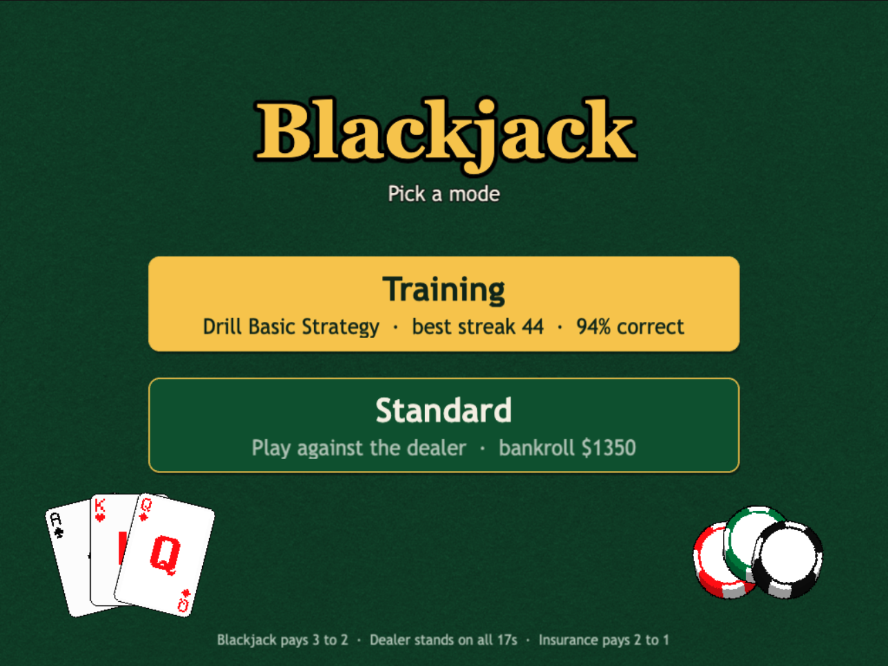

# Blackjack

A blackjack game for the browser, built with [Phaser 4](https://github.com/phaserjs/phaser), TypeScript and
[Vite](https://vitejs.dev/). It has two modes: one for learning Basic Strategy and one for playing a normal
game against the dealer. There is no server; everything runs in the browser and progress is kept in
`localStorage`.



## Modes

### Training

Drills Basic Strategy one hand at a time. You are dealt a hand, pick your first move (hit, stand, double or
split), and it is scored against Basic Strategy. Only that first move is played, with no dealer play-out and
no money.

- Tracks hands seen, hands correct, a live streak and a best streak.
- Stats and the best streak survive reloads.
- Hands with no decision to make (a player natural, or a dealer natural) are skipped.

### Standard

One-on-one blackjack against the dealer, played with chips.

- By default blackjack pays 6 to 5, the dealer stands on all 17s, doubling after a split is allowed, and
  there is no surrender. The settings panel can change each of these rules (see below).
- The dealer peeks for blackjack.
- Insurance is offered when the dealer shows an Ace and pays 2 to 1.
- Double down on any two-card hand, including after a split (unless that rule is off).
- Split pairs up to four hands; split Aces get one card each.
- The shoe is reshuffled when a quarter of it is left.
- Late surrender, when turned on, gives up the first two cards for half the bet back (rounded down), after
  the dealer has peeked.
- Keyboard play: `H` hit, `S` stand, `D` double, `P` split, `R` surrender, `Y` / `N` take or decline insurance, and
  `Space` or `Enter` to deal.
- The settings panel sets the shoe size (1, 2, 4, 6 or 8 decks), the starting bankroll ($100 to $5000), and
  the table rules: blackjack pays 3:2 or 6:5, the dealer hits or stands on soft 17, double after split on
  or off, and late surrender on or off. The default is 6 decks and $500. Ask the Dealer follows the table's
  rules; Training always drills the default rules.
- A line along the bottom counts rounds, wins, losses and pushes, blackjacks, the biggest single-round
  win and the peak balance. It restarts when the bankroll setting changes, but not when the balance runs
  out.

The balance is saved after every change, so reloading in the middle of a round forfeits that round's bet.

## Getting started

[Node.js](https://nodejs.org) is required.

```bash
npm install
npm run dev
```

The dev server runs on <http://localhost:8080> with hot reloading.

| Command | Description |
|---------|-------------|
| `npm run dev` | Start the development server |
| `npm run build` | Create a production build in `dist/` |
| `npm run preview` | Serve the production build locally |
| `npm run clean` | Delete `dist/` |
| `npm test` | Run the rules and strategy tests (Vitest) |
| `npx tsc --noEmit` | Type check (there is no npm script for this) |

Tests cover the rules in `src/game/logic/`. There is no linter configured.

To deploy, upload the contents of `dist/` to any static web host. The build uses relative paths, so it works
from a subdirectory.

## Project structure

| Path | Description |
|------|-------------|
| `src/main.ts` | Waits for the DOM, then starts the game |
| `src/game/main.ts` | The Phaser game config and scene list |
| `src/game/logic/` | Rules and strategy: cards, shoe, hands, dealer, `StandardGame`, `TrainingSession`. No Phaser imports. |
| `src/game/scenes/` | `Preloader`, `MainMenu`, `Training`, `Standard` |
| `src/game/ui/` | Buttons, chips, hand and card rendering, settings modal, sprite atlas and theme |
| `src/game/storage.ts` | The only code that touches `localStorage` |
| `public/assets/` | Images, copied as-is to `dist/assets/` |

Rules and rendering are kept apart. The scenes draw a view object and forward clicks, and the rules live
in `logic/`, which can be bundled and run from Node without Phaser.

The canvas is a fixed 1024×768 space scaled to fit the window, so all layout uses those coordinates. In dev,
`window.__phaser` is the running `Game`, which is handy for inspecting state from the browser console.

## Saved data

Two `localStorage` keys are used: `blackjack3.training` (hands seen, hands correct, best streak) and
`blackjack3.table` (balance, shoe size, starting bankroll). Clearing site data resets both.

## License

See [LICENSE](LICENSE). Built on the [phaserjs/template-vite-ts](https://github.com/phaserjs/template-vite-ts)
template.
