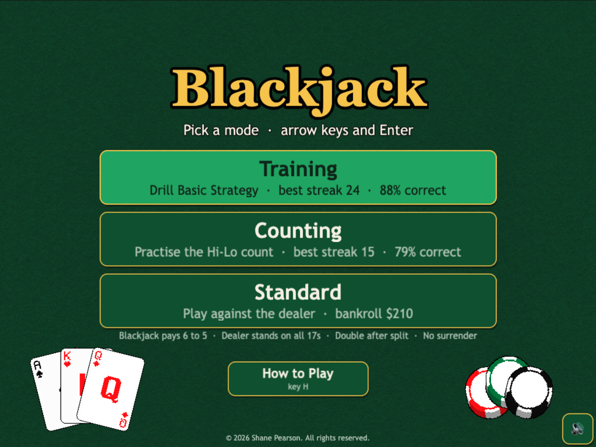

# Blackjack

A blackjack game for the browser, built with [Phaser 4](https://github.com/phaserjs/phaser), TypeScript and
[Vite](https://vitejs.dev/). It has three modes: one for learning Basic Strategy, one for practising the Hi-Lo
card count, and one for playing a normal game against the dealer. There is no server; everything runs in the browser and progress is kept in
`localStorage`.



## Modes

### Training

Drills Basic Strategy one hand at a time. You are dealt a hand, pick your first move (hit, stand, double or
split), and it is scored against Basic Strategy. Only that first move is played, with no dealer play-out and
no money.

- Tracks hands seen, hands correct, a live streak and a best streak.
- Stats and the best streak survive reloads.
- Pick which hands are dealt: All, Hard, Soft or Pairs (keys 1–4). Each deal picks a square of those charts
  (hand × dealer up card) and builds cards for it, so rare hands come up as often as common ones, and there
  is never a natural on either side.
- A square you miss is dealt more often (up to 3×) until you answer it right; the Mistakes chart (K) outlines
  the squares you are still missing and lists the worst.

### Counting

Practises the Hi-Lo card count. Cards flip off a shoe one at a time, and every 8 to 16 cards play stops and
asks for the running count.

- Hi-Lo tags: 2–6 count +1, 7–9 count 0, and tens and Aces count −1.
- Every other quiz also asks for the true count: the running count divided by the decks left in the shoe
  (to the nearest half deck, never less than half a deck), rounded toward zero.
- Three speeds: Slow (a card every 1.5 s), Medium (1 s) and Fast (0.6 s), on keys 1–3. The shoe can be
  1, 2, 4, 6 or 8 decks (6 by default). It is reshuffled, and the count goes back to 0, when a quarter of it
  is left.
- Type the answer with the digit keys, `-` to flip the sign, `Backspace` to delete, or `↑` / `↓` to step it,
  then `Enter`. `Space` or `Enter` pauses and resumes the cards, and moves on after the feedback.
- Tracks answers, accuracy, a live streak, a best streak and the average answer time (a single answer
  counts for at most 30 seconds). Stats, speed and shoe size are saved; Reset stats (click twice) clears them.

### Standard

One-on-one blackjack against the dealer, played with chips.

- By default blackjack pays 6 to 5, the dealer stands on all 17s, doubling after a split is allowed, and
  there is no surrender. The settings panel can change each of these rules (see below).
- The dealer peeks for blackjack.
- Insurance is offered when the dealer shows an Ace and pays 2 to 1.
- Double down on any two-card hand, including after a split (unless that rule is off).
- Split pairs up to four hands; split Aces get one card each.
- The shoe is reshuffled when a quarter of it is left, and the dealer burns the first card after every shuffle.
- Late surrender, when turned on, gives up the first two cards for half the bet back (rounded down), after
  the dealer has peeked.
- Keyboard play: `H` hit, `S` stand, `D` double, `P` split, `R` surrender, `Y` / `N` take or decline insurance, and
  `Space` or `Enter` to deal.
- The settings panel sets the shoe size (1, 2, 4, 6 or 8 decks), the starting bankroll ($100 to $5000), and
  the table rules: blackjack pays 3:2 or 6:5, the dealer hits or stands on soft 17, double after split on
  or off, and late surrender on or off. The default is 6 decks and $500. Ask the Dealer follows the table's
  rules; Training always drills the default rules.
- A line along the bottom counts rounds, wins, losses and pushes, blackjacks, the biggest single-round
  win and the peak balance. It restarts when the bankroll setting changes, but not when the balance runs
  out.

The balance is saved after every change, so reloading in the middle of a round forfeits that round's bet.

### Controls, accessibility and offline play

- On the main menu the arrow keys pick a mode and `Enter` or `Space` starts it. In every game mode `Esc` goes
  back to the menu (in Standard it closes the settings panel first).
- Wins, losses and pushes are shown in blue, vermilion and grey rather than green and red, and never by
  colour alone: hands say WIN / LOSE / PUSH, answers start with ✓ or ✗, and the balance shows ▲ or ▼.
- On touch screens every button's tap area reaches a little past its edge.
- The production build is a Progressive Web App: it can be installed, and once loaded it plays offline
  (see [Installing for offline play](#installing-for-offline-play)).

### Sound

Cards, chips and results have sound effects, synthesized in the browser (there are no audio files).
The speaker button in the bottom-right corner of every screen, or the `M` key, turns sound off and on,
and the setting is saved.

## Installing for offline play

The game can be installed as an app and played without a network connection.

1. Open a production build over HTTPS (the deployed site) or on localhost (`npm run build && npm run preview`).
   The dev server (`npm run dev`) does not register the service worker, so it cannot be installed.
2. Let the game load once while online. The service worker caches everything it needs on that first visit.
3. Install it:
   - **Chrome or Edge (desktop):** the install icon at the right end of the address bar, or the browser menu
     (Chrome: *Cast, save and share* → *Install page as app*; Edge: *Apps* → *Install this site as an app*).
   - **Android (Chrome):** menu → *Add to Home screen* or *Install app*.
   - **iPhone or iPad (Safari):** Share → *Add to Home Screen*.
   - **Firefox (desktop):** cannot install web apps, but a loaded page still works offline in a normal tab.

The installed app opens full screen in landscape. It picks up a new version the next time it is launched
while online. Saved stats and bankroll belong to the address the game was installed from, so an app
installed from localhost does not share progress with the deployed site.

To check offline play, run `npm run preview`, open DevTools → *Application*, turn on *Offline* and reload.

## Getting started

[Node.js](https://nodejs.org) is required.

```bash
npm install
npm run dev
```

The dev server runs on <http://localhost:8080> with hot reloading.

| Command | Description |
|---------|-------------|
| `npm run dev` | Start the development server |
| `npm run build` | Create a production build in `dist/` |
| `npm run preview` | Serve the production build locally |
| `npm run clean` | Delete `dist/` |
| `npm test` | Run the rules and strategy tests (Vitest) |
| `npx tsc --noEmit` | Type check (there is no npm script for this) |

Tests cover the rules in `src/game/logic/`. There is no linter configured.

To deploy, upload the contents of `dist/` to any static web host. The build uses relative paths, so it works
from a subdirectory. It includes a web manifest and a service worker (from `vite-plugin-pwa`), so it can be
installed and played offline; the dev server does not register the worker.

## Project structure

| Path | Description |
|------|-------------|
| `src/main.ts` | Waits for the DOM, then starts the game |
| `src/game/main.ts` | The Phaser game config and scene list |
| `src/game/logic/` | Rules and strategy: cards, shoe, hands, dealer, `StandardGame`, `TrainingSession`, `CountingSession`. No Phaser imports. |
| `src/game/scenes/` | `Preloader`, `MainMenu`, `Training`, `Counting`, `Standard`, `HowToPlay` |
| `src/game/ui/` | Buttons, chips, hand and card rendering, settings modal, sprite atlas and theme |
| `src/game/storage.ts` | The only code that touches `localStorage` |
| `public/assets/` | Images, copied as-is to `dist/assets/` |

Rules and rendering are kept apart. The scenes draw a view object and forward clicks, and the rules live
in `logic/`, which can be bundled and run from Node without Phaser.

The canvas is a fixed 1024×768 space scaled to fit the window, so all layout uses those coordinates. In dev,
`window.__phaser` is the running `Game`, which is handy for inspecting state from the browser console.

## Saved data

Four `localStorage` keys are used: `blackjack3.training` (hands seen, hands correct, best streak, missed
chart squares), `blackjack3.counting` (answers, correct answers, best streak, answer times, shoe size and
speed), `blackjack3.table` (balance, settings, table rules, stats) and `blackjack3.sound` (mute). Clearing
site data resets them all.

## License

See [LICENSE](LICENSE). Built on the [phaserjs/template-vite-ts](https://github.com/phaserjs/template-vite-ts)
template.
